# The Interview No-Show Problem

### Contributors: Nick Gygongyosi, Jarid Siewierski, Fred Berendse

## Overview 
A recent Kaggle competition asked participants to predict if interview candidates would show up for an interview scheduled by a recruiter. All of the interviews were scheduled in India between 2014 and 2016. The data are contained in a comma-separated file with 1234 rows of data and 27 columns. This case study will attempt to predict whether an interviewee will show using nonparametric supervised learning models.

## Data Cleanup

The [list of columns](table_columns.md) in the dataset contain some unfriendly names e.g. entire questions. We translated these into friendlier columns also shown in the table. We will refer to the friendlier column names for the remainder of this presentation.

We ran into the following significant issues when cleaning the dataset:

### Yes/No question columns
There are seven columns in the dataset which contain candidate responses to Yes/No questions. All of these columns contained more than two categories. Many of these nonconforming responses were "not sure", "will check", etc. For this reason we decided to encode "yes" responses as 1 and all other answers as 0.

### Locations
The **Candidate Native Location** column contains 47 different locations. We considered looking up these locations and grouping them into regions, but decided against this due to time constraints. 

There are four other location-like columns in the dataset: **Location**, **Candidate Current Location**, **Candidate Job Location**, and **Interview Venue**. The **Location** and **Candidate Current Location** columns contain identical information, which leaves three independent location columns. 

We calculated the distances between these locations by creating a distance matrix. Distances were obtained from an [online distance calculator](https://distancecalculator.globefeed.com/India_Distance_Calculator.asp). What we discovered after calculating these distances was that the dataset are highly imbalanced toward zero distances.

| Candidate to Job (km) | Frequency |
|---------------|-----------|
| 0 | 1155 |
| 43 | 1 |
| 268 | 1 |
| 290 | 34 | 
| 503 | 17 | 
| 515 | 21 | 
| 602 | 1 |
| 799 | 1 |

| Candidate to Interview (km) | Frequency |
|---------------|-----------|
| 0 | 1208 |
| 39 | 4 |
| 43 | 1 |
| 268 | 5 |
| 290 | 11 | 
| 515 | 4 |

## Models and Results

The data set contains 701 interviewees who showed and 532 interviewees who did not show - a fairly balanced dataset. Because we are mainly interested in predicting when an interviewee will **not** show, no-shows were coded as 1 in the dataset.

We attempted to predict whether an individual would show for an interview with a KNN model, a random forest model, a gradient boosted model, and an extreme gradient boosted model. The client is most likely more willing to accept false positives (_i.e._ flagged as a no-show when actually a show) than false negatives (_i.e._ flagged as a show when actually a no-show). Therefore, we will aim to maximize the recall of our models. 

Each of these models utilized the following columns in the dataset as features:

* gender
* start_perm (Did the applicant obtain permission to interview?)
* unsch_mtgs (Does the applicant hope they have no unschedule meetings?)
* precall (Is the applicant OK with a reminder phone call?)
* alt_num (Is the applicant willing to provide an alternate number?)
* res_jd (Does the applicant have a printed resume and has the applicant read the job description?)
* venue_clear (Is the applicant clear on how to get to the interview venue?)
* letter_shared (Did the applicant share a cover letter?)
* mar_status
* weekdays (Day of the week)
* d_loc2job (Distance from the applicant's location to the potential job)
* d_loc2int (Distance from the applicant's location to the interview site)

In all of our models, we held out 25% of the rows for validating performance. 

### Expected Attendance

This dataset is unique in that it already contains predictions from recruitment staff. It would be interesting to see how our numerical models compare to those of humans who interviewed each person. The confusion matrix based on human predictions is as follows:

| | Actual No Show | Actual Show |
|--|------------|----------------|
| **Predicted No Show** | 241 | 110 |
| **Predicted Show** | 291 | 591 | 
|||

| | |
|-|-|
| **Accuracy** | 0.675 |
| **Precision** | 0.687 |
| **Recall** | 0.453 |
| **Specificity** | 0.843 | 
| **F1 score** | 0.546 |
|||

### K-Nearest Neighbors 

We first utilized a K-Nearest Neighbors model with a hyperparameter of 3 nearest neighbors and a leaf size of 20. The accuracy of this test was not as high as the predictions by the staff members, but the recall was an improvement.

| | |
|-|-|
| **Accuracy** | 0.599 |
| **Precision** | 0.577 |
| **Recall** | 0.497 |
| **Specificity** | 0.687 | 
| **F1 score** | 0.534 |
|||

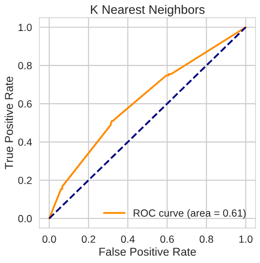

### Random Forest 
Next, we attempted to utilize sklearn's Random Forest model with a Gini index as the criterion. The hyperparameters that resulted in the highest recall score are:

* Number of Estimators: 300
* Split Criterion: Gini index
* Max Depth: Unlimited
* Minimum Samples per Split: 8

#### Feature selection without cross-validation:

| | |
|-|-|
| **Accuracy** | 0.699 |
| **Precision** | 0.736 |
| **Recall** | 0.545 |
| **Specificity** | 0.831 | 
| **F1 score** | 0.627 |
|||

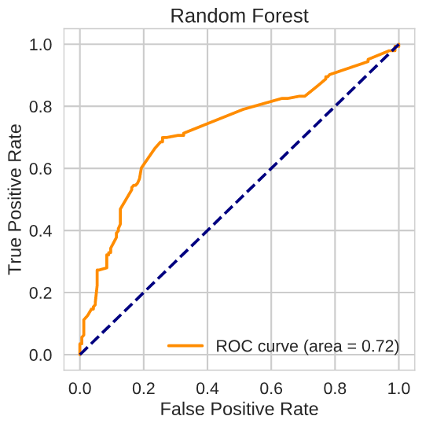

The random forest model identified three features being more important than the others: the day of the week, permission to interview obtained (start_perm), and a cover letter shared with the employer (letter_shared). 

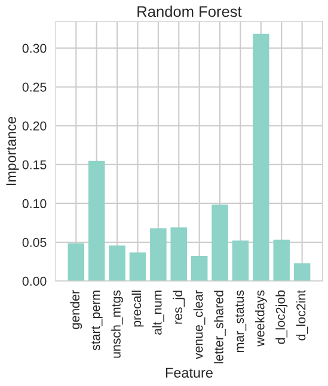

A partial dependence plot of the most important feature, weekday, reveals that the model is more likely to predict a no-show if the interview weekday is Wednesday (2) or Saturday (5). 

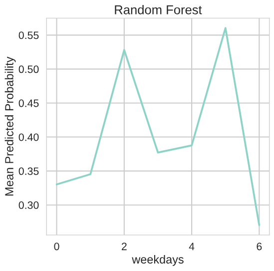

The two next important features: start_perm and letter_shared, show a definite inverse between the probability of not showing and each feature.

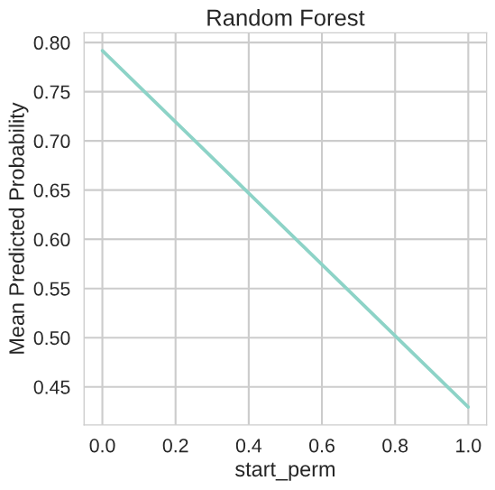

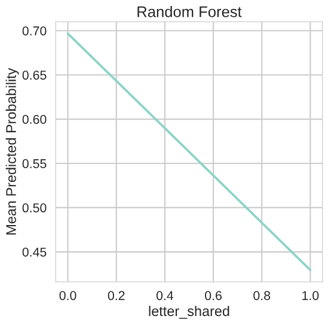

### Gradient Boost

Our efforts to fit the data to a gradient boost model resulted in an accuracy and recall less than random forest model. The hyperparameters that produced the highest recall are: 

* Number of Estimators: 100
* Loss Function: Exponential (Adaboost)
* Split Criterion: Mean Absolute Error
* Learning Rate: 0.01
* Max Tree Depth: 3

| | |
|-|-|
| **Accuracy** | 0.650 |
| **Precision** | 0.706 |
| **Recall** | 0.420 |
| **Specificity** | 0.849 | 
| **F1 score** | 0.526 |
|||

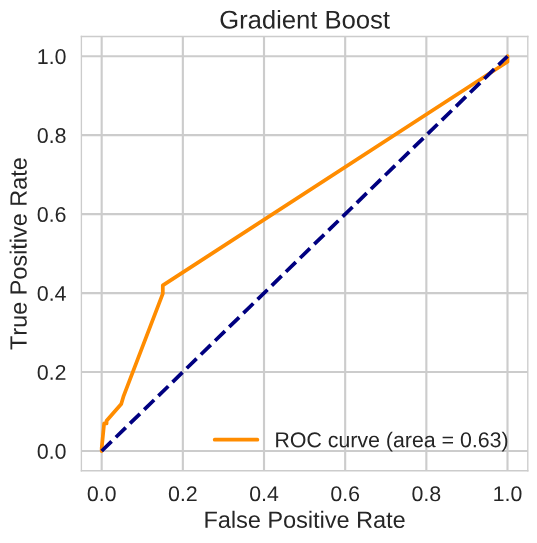

Unlike the random forest model, the best gradient boost model did not deem the day of the week important - a surprising result. Instead, the three most important features were start permission (start_perm), alternative contact number (alt_num), and permission to give a reminder call (precall). 

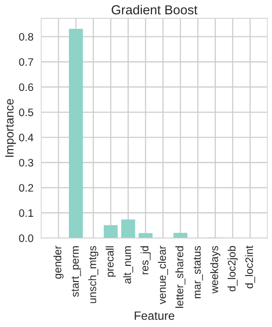

As expected, all three of these features have an inverse relationship with the mean predicted probability of not showing to an interview.

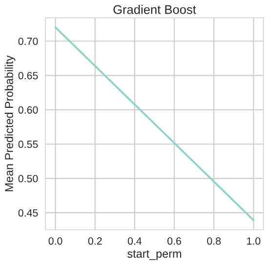

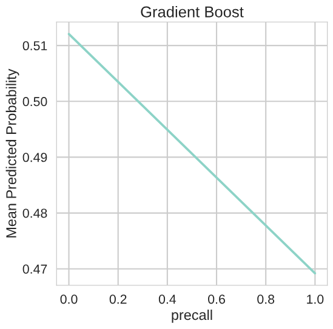

## Extreme Gradient Boost
The extreme gradient boost model provided a slight improvement over the gradient boosted model, but did not match the performance of the random forest model. The best performing model turned out to have a much smaller learning rate and many more estimators than the gradient boost model:

* Number of Estimators: 400
* Learning Rate: 0.005
* Gradient Booster: gbtree
* Max Tree Depth: 2

| | |
|-|-|
| **Accuracy** | 0.657 |
| **Precision** | 0.713 |
| **Recall** | 0.434 |
| **Specificity** | 0.849 | 
| **F1 score** | 0.539 |
|||

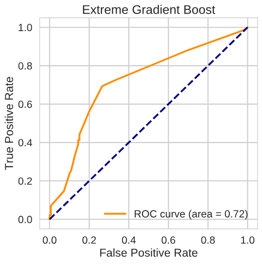

The exterme gradient boost model ranked start permission (start_perm) and alternate number (alt_num) the highest importance - consistent with the gradient boost model. However, many more features carry relatively high importance compared to the gradient boost model. 

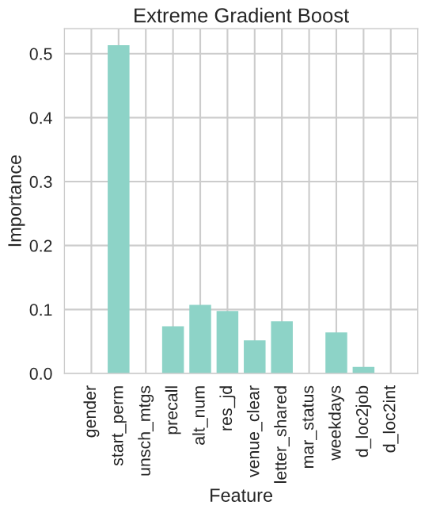

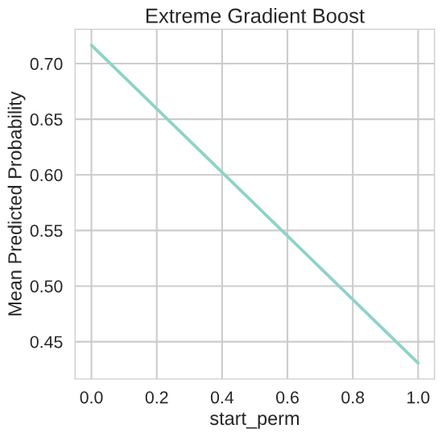

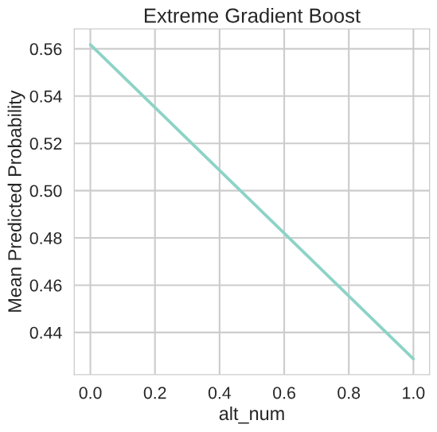

## Conclusion and Lessons Learned
We attempted to predict interview no-shows in India between 2014 and 2016 with four nonparametric supervised learning models. The best performance was obtained by a random forest model with 300 estimators, a Gini index split criterion, and a mininum of 8 samples in a split. With this model, we obtained a recall of 0.545 and an accuracy of 0.699. We attempted recursive feature elimination with random forest and gradient boost models, but found no improvement in performance.

We would recommend to recruiters that the greatest predictors of showing up to an interview is ensuring that the candidate received permission from their current employer to begin the interview process and providing an alternate contact number. Our random forest model also predicts that no-shows occur more frequently on Wednesdays and Saturdays.

One possible next step would be to clean and one-hot encode the industry and skills columns included in the dataset. (We ignored these columns due to time constraints.) 

