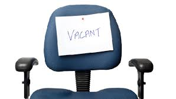
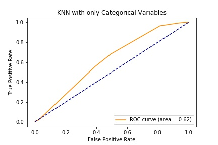
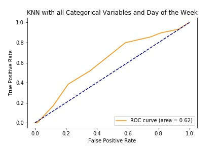
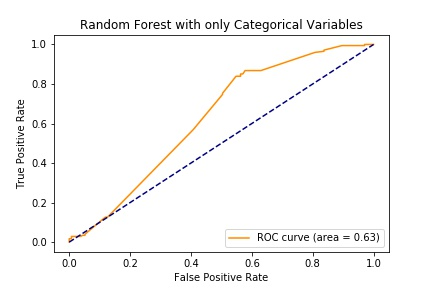
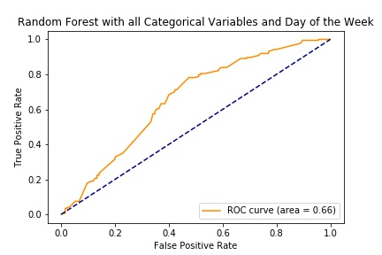
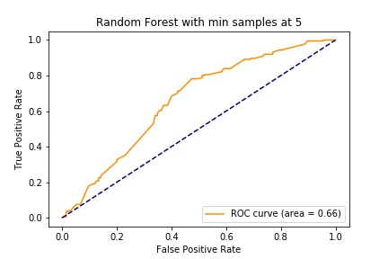
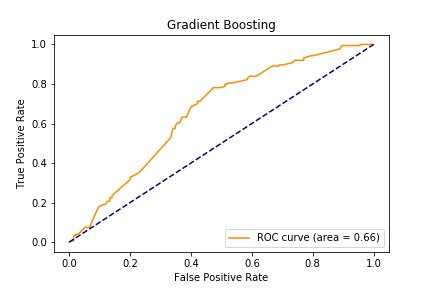

# The Interview No-Show Problem

### Contributors: Nick Gygongyosi, Jarid Siewierski, Fred Berendse

## Overview 
A recent Kaggle competition asked participants to predict if interview candidates would show up for an interview scheduled by a recruiter. All of the interviews were scheduled in India between 2014 and 2016. The data are contained in a comma-separated file with 1234 rows of data and 27 columns. This case study will attempt to predict whether an interviewee will show using nonparametric supervised learning models.

## Data Cleanup

The [list of columns](table_columns.md) in the dataset contain some unfriendly names e.g. entire questions. We translated these into friendlier columns also shown in the table. We will refer to the friendlier column names for the remainder of this presentation.

We ran into the following significant issues when cleaning the dataset:

### Yes/No question columns
There are seven columns in the dataset which contain candidate responses to Yes/No questions. All of these columns contained more than two categories. Many of these nonconforming responses were "not sure", "will check", etc. For this reason we decided to encode "yes" responses as 1 and all other answers as 0.

### Locations
The **Candidate Native Location** column contains 47 different locations. We considered looking up these locations and grouping them into regions, but decided against this due to time constraints. 

There are four other location-like columns in the dataset: **Location**, **Candidate Current Location**, **Candidate Job Location**, and **Interview Venue**. The **Location** and **Candidate Current Location** columns contain identical information, which leaves three independent location columns. 

We calculated the distances between these locations by creating a distance matrix. Distances were obtained from an [online distance calculator](https://distancecalculator.globefeed.com/India_Distance_Calculator.asp). What we discovered after calculating these distances was that the dataset are highly imbalanced toward zero distances.

| Candidate to Job (km) | Frequency |
|---------------|-----------|
| 0 | 1155 |
| 43 | 1 |
| 268 | 1 |
| 290 | 34 | 
| 503 | 17 | 
| 515 | 21 | 
| 602 | 1 |
| 799 | 1 |

| Candidate to Interview (km) | Frequency |
|---------------|-----------|
| 0 | 1208 |
| 39 | 4 |
| 43 | 1 |
| 268 | 5 |
| 290 | 11 | 
| 515 | 4 |

## Models and Results

The data set contains 701 interviewees who showed and 532 interviewees who did not show - a fairly balanced dataset. Interviewees who showed were coded as 1 in the dataset.

We attempted to predict whether an individual would show for an interview with a KNN model, a random forest model, and gradient boosted model.

Each of these models utilized the following columns in the dataset as features:

* gender
* start_perm 
* unsch_mtgs
* precall 
* alt_num
* res_jd
* venue_clear
* letter_shared
* exp_attend
* mar_status
* weekdays
* d_loc2job
* d_loc2int

In all of our models, we held out 25% of the rows for validating performance. 

### Expected Attendance

This dataset is unique in that it already contains predictions from recruitment staff. It would be interesting to see how our numerical models compare to those of humans who interviewed each person. The confusion matrix based on human predictions is as follows:

| | Actual Show | Actual No Show |
|--|------------|----------------|
| **Predicted Show** | 591 | 291 |
| **Predicted No Show** | 110 | 241 | 
|||

| | |
|-|-|
| **Accuracy** | 0.715 |
| **Precision** | 0.670 |
| **Recall** | 0.843 |
| **Specificity** | 0.453 | 
| **F1 score** | 0.747 |
|||

### K-Nearest Neighbors 

We utilized a K-Nearest Neighbors model with a hyperparameter of 8 nearest neighbors to give us a baseline for improvement. We attempted this model with all of the features and with only binary categorical data (i.e. "Yes/No", "Marital Status", "Gender") 

| Features Used | Test Accuracy |
|---------------|----------|
| All features | 57% |
| Binary only | 61% |
|||

### Random Forest 
The hyperparameters that resulted in the highest accuracy score are:

* Number of Estimators: 100
* Minimum Samples per Leaf: 5
* Random State: 5 (selects the same features every time the classifier is re-run)
* Number of features selected (no CV only): 5 
* Number of features removed per iteration: 1 

#### Feature selection without cross-validation:

| Features Used | Test Accuracy |
|---------------|----------|
| All features (no CV) | 69% |
| Binary only (no CV) | 67% |
| All features (CV) | 70% |
|||

Features selected without cross-validation:
* start_perm
* alt_num
* res_jd
* exp_attend
* weekdays

Features selected With cross-validation:
* gender
* start_perm
* alt_num
* res_jd
* letter_shared
* exp_attend
* mar_status
* weekdays
* d_loc2job

### Gradient Boost

The hyperparameters that resulted in the highest accuracy score are:

* Loss: Exponential (Adaboost)
* Learning Rate: 0.05
* Random State: 10 (selects the same features every time the classifier is re-run)
* Number of features selected (no CV only): 5 
* Number of features removed per iteration: 1 

| Features Used | Test Accuracy |
|---------------|----------|
| All features (no CV) | 66% |
| All features (CV) | 69% |

Features selected without cross-validation:
* gender
* precall
* exp_attend
* weekdays
* d_loc2int

Features selected with cross-validation:
* exp_attend

## Conclusion and Lessons Learned
* Cleaning is half the battle
    * Empty columns
    * Duplicate columns (locations)
    * Separating categoricals
* For this dataset, random forests with feature selection cross-validation was the most effective model with 69%, used all features except distance from location to interview, unscheduled meetings, precall, venue clear, jd_res
* Gradient boosting with feature selection and cross-validation was a close second with 69% use with one feature (expected attendance)

Next Steps
* One-hot encode all the categorical columns
* Engineer new features
    * Interview time coincide with:
    * Busy traffic times
    * Holidays
    * Sporting events